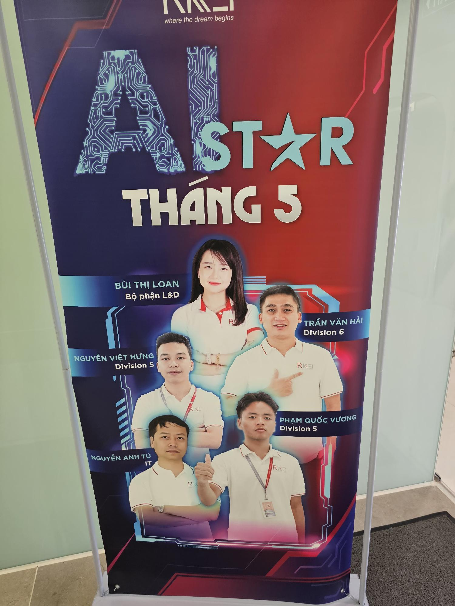
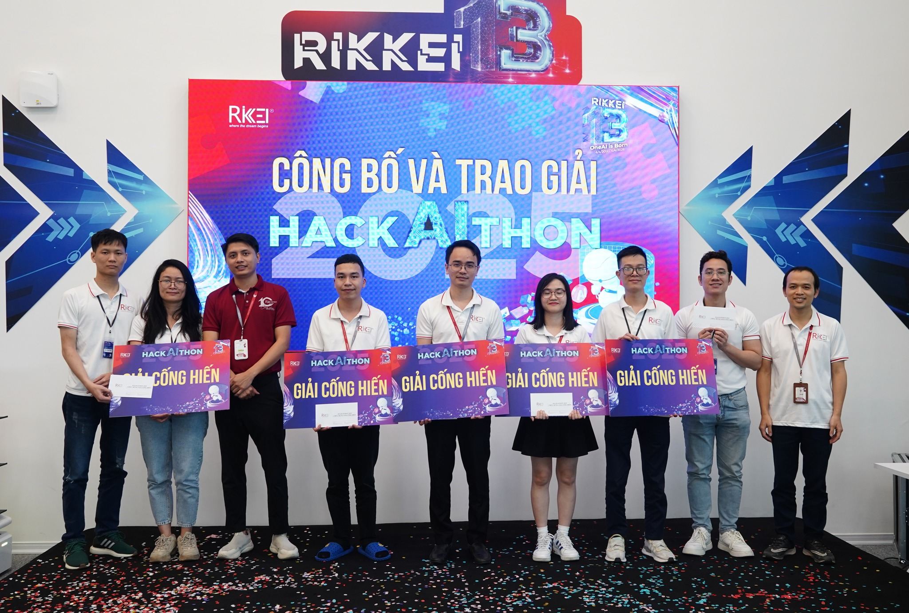

!Hey there, I'm hungnv1997. I'm a software developer.

  &nbsp;  &nbsp; 

# 👋 &nbsp;Hi there

I'm a software developer based in VietNam. I enjoy coding open-source projects that solve unique problems. I love combining my hobbies like 3D, coding and building various projects with Reactjs, Vuejs, Golang.

&nbsp;

## 🏆 &nbsp;Awards & Recognition

  
  
  **AI Star of the Month - May 2024** 🌟
  
  *Recognized for outstanding contributions in AI development and innovation*
  
    
  
  
  **Rikkei 3 Hackathon - Achievement Award** 🏅
  
  *Winner of Achievement Award at Rikkei 3 Hackathon competition**
    
  

&nbsp;

## 👇 &nbsp;Current project

I'm currently working on [@Bee-fast](https://www.npmjs.com/package/bee-fast). A self-hosted solution for tweet scheduling and analytics aimed at home labs. It will be free and open source. Follow the [Twitter](https://twitter.com/tweetormator) feed to keep up with progress.

&nbsp;

<!-- ## ✏️ &nbsp;Blog posts -->

<!-- BLOG-POST-LIST:START -->
<!-- - [Reverse engineering Reolink cameras for custom scenes and modes with Home Automation](https://cyris.io/blog/reverse-engineer-reolink)
- [Reverse engineering a private API with MITM Proxy](https://cyris.io/blog/reverse-engineer-api-copy)
- [Generating dynamic images on the fly for Email Marketing](https://cyris.io/blog/canvas-image-generation)
- [Use Twitter to find developer friends near you](https://cyris.io/blog/find-developer-friends) -->
<!-- BLOG-POST-LIST:END -->

<!-- &nbsp; -->

## 🧰 &nbsp;My toolbox

 &nbsp; &nbsp; &nbsp;  &nbsp; &nbsp;  &nbsp; &nbsp; &nbsp; &nbsp; &nbsp; &nbsp;

&nbsp;

<!-- ## 🖥 &nbsp;Past work

 &nbsp; 

&nbsp; -->

## 📊 &nbsp;Stats

